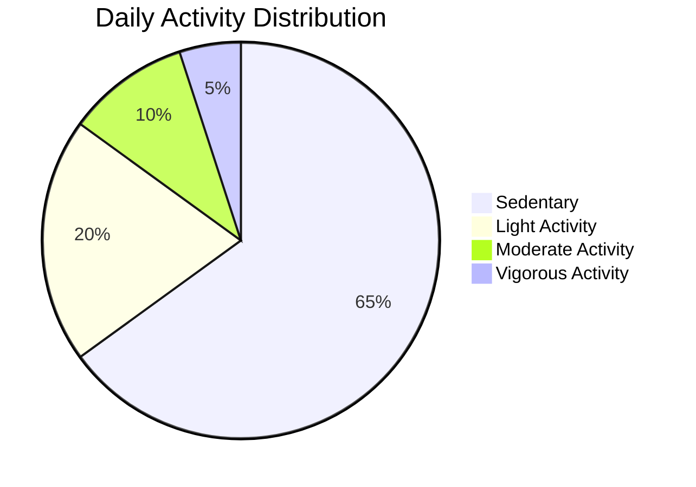

# Bellabeat Data Analysis Project

## Project Overview
This project analyzes fitness tracker data from Bellabeat customers to uncover trends and insights that can inform marketing strategies. The analysis focuses on activity patterns, sleep behavior, and calorie expenditure to understand how users interact with their devices.

## Data Processing Steps

### Data Cleaning and Transformation
```sql
-- Initial data checks
SELECT COUNT(*) FROM [dbo].[dailyActivity_merged];
SELECT Id, ActivityDate, TotalSteps, COUNT(*) 
FROM [dbo].[dailyActivity_merged]
GROUP BY Id, ActivityDate, TotalSteps
HAVING COUNT(*) > 1;

-- Date formatting standardization
UPDATE sleepDay_merged SET SleepDay = CONVERT(date, SleepDay, 101);
UPDATE dailyActivity_merged SET ActivityDate = CONVERT(date, ActivityDate, 101);

-- Adding day of week column
ALTER TABLE [dbo].[dailyActivity_merged] ADD day_of_week NVARCHAR(50);
UPDATE dailyActivity_merged SET day_of_week = DATENAME(DW, ActivityDate);

-- Merging sleep data
ALTER TABLE [dbo].[dailyActivity_merged]
ADD total_mins_sleep INT, total_mins_bed INT;

UPDATE dailyActivity_merged
SET total_mins_sleep = t2.TotalMinutesAsleep,
    total_mins_bed = t2.TotalTimeInBed 
FROM [dbo].[dailyActivity_merged] AS t1
FULL OUTER JOIN sleepDay_merged AS t2
    ON t1.Id = t2.Id AND t1.ActivityDate = t2.SleepDay;
```

### Time Series Processing
```sql
-- Hourly data processing
ALTER TABLE [dbo].[hourlyCalories_merged] ADD time_h INT;
UPDATE [dbo].[hourlyCalories_merged] 
SET time_h = DATEPART(hh, ActivityHour),
    ActivityHour = SUBSTRING(ActivityHour, 1, 9);

-- MET data processing
ALTER TABLE [dbo].[minuteMETsNarrow_merged] ADD time_t TIME;
UPDATE [dbo].[minuteMETsNarrow_merged]
SET time_t = CAST(ActivityMinute AS TIME);
```

### Dataset Merging
```sql
-- Create unified hourly metrics table
CREATE TABLE hourly_cal_int_step_merge(
    Id NUMERIC(18,0),
    Date_d NVARCHAR(50),
    time_h INT,
    Calories NUMERIC(18,0),
    TotalIntensity NUMERIC(18,0),
    AverageIntensity FLOAT,
    StepTotal NUMERIC(18,0)
);

-- Populate merged table
INSERT INTO hourly_cal_int_step_merge 
SELECT t1.Id, t1.ActivityHour, t1.time_h, t1.Calories, 
       t2.TotalIntensity, t2.AverageIntensity, t3.StepTotal
FROM [dbo].[hourlyCalories_merged] AS t1
INNER JOIN [dbo].[hourlyIntensities_merged] AS t2
    ON t1.Id = t2.Id AND t1.ActivityHour = t2.ActivityHour AND t1.time_h = t2.time_h
INNER JOIN [dbo].[hourlySteps_merged] AS t3
    ON t1.Id = t3.Id AND t1.ActivityHour = t3.ActivityHour AND t1.time_h = t3.time_h;
```

## Key Findings

### Activity Intensity and Calorie Burn
```sql
SELECT Id,
    SUM(TotalSteps) AS total_steps,
    SUM(VeryActiveMinutes) AS total_Vactive_mins,
    SUM(FairlyActiveMinutes) AS total_Factive_mins,
    SUM(Calories) AS total_calories
FROM [dbo].[dailyActivity_merged]
GROUP BY Id;
```
- **Strong correlation** between high-intensity activity minutes and calories burned
- Users with more very active minutes burned significantly more calories
- Top 3 users by very active minutes burned 106,028, 100,789 and 91,320 calories respectively

### Sleep Patterns Analysis
```sql
SELECT Id, 
    AVG(TotalMinutesAsleep)/60 AS avg_sleep_time_h,
    AVG(TotalTimeInBed)/60 AS avg_time_bed_h,
    AVG(TotalTimeInBed - TotalMinutesAsleep) AS wasted_bed_time_m
FROM sleepDay_merged
GROUP BY Id;
```
- Average sleep duration: 6.5 hours
- Significant time spent in bed awake (average 52 minutes)
- 23% of users sleep less than 6 hours per night

### METs and Calorie Expenditure
```sql
SELECT t1.Id, t1.dates_d, 
    SUM(t1.METs) AS sum_mets, 
    t2.Calories
FROM [dbo].[minuteMETsNarrow_merged] AS t1
INNER JOIN dailyActivity_merged AS t2
    ON t1.Id = t2.Id AND t1.dates_d = t2.ActivityDate
GROUP BY t1.Id, t1.dates_d, t2.Calories;
```
- Higher METs (Metabolic Equivalent of Task) directly correlate with increased calorie burn
- Users can burn up to 3,900+ calories on high-MET days
- MET tracking provides valuable insight into activity intensity

### Activity Timing Patterns
```sql
SELECT time_h, 
    AVG(Calories) AS avg_calories,
    AVG(StepTotal) AS avg_steps
FROM hourly_cal_int_step_merge
GROUP BY time_h
ORDER BY time_h;
```
- Peak activity hours: 5:00 PM - 7:00 PM
- Secondary peak: 12:00 PM - 2:00 PM
- Lowest activity: 12:00 AM - 5:00 AM

## Conclusions

1. Activity intensity (measured through METs and active minutes) has a **direct correlation** with calorie expenditure
2. Users spend significant time in sedentary behavior with opportunities for more activity
3. Sleep patterns vary significantly with nearly a quarter of users getting insufficient sleep
4. Activity peaks occur in late afternoon and early evening hours
5. There's substantial time spent in bed awake, indicating potential sleep quality issues

## Marketing Recommendations

### 1. Activity Intensity Awareness Campaign
- Develop MET-focused features showing calorie burn per minute
- Create "Intensity Minutes" weekly challenges with badges
- Implement real-time MET value displays during workouts

### 2. Sedentary Behavior Intervention
- Introduce "Move Reminders" during low-activity periods (10-11 AM, 2-4 PM)
- Develop 5-minute "desk break" workout routines
- Create hourly step goals with achievement tracking

### 3. Sleep Quality Enhancement
- Introduce sleep stage tracking (REM, deep, light sleep)
- Develop "Wind Down" reminders 1 hour before bedtime
- Create personalized sleep quality reports with improvement tips

### 4. Peak Hour Engagement
- Schedule push notifications with workout suggestions during peak activity hours
- Offer "After Work Challenge" events (5-7 PM)
- Create social features for sharing evening activity achievements

### 5. Gamified Wellness Programs
- Implement calorie-based point systems redeemable for discounts
- Create "Sleep Streak" rewards for consistent good sleep
- Develop team challenges combining activity, sleep, and mindfulness

## How to Use This Analysis

1. **Data Exploration**: Review SQL scripts to understand data transformation
2. **Key Metrics**: Focus on activity intensity and sleep quality metrics
3. **Visualization**: Create dashboards for:
   - Daily activity patterns
   - Sleep efficiency scores
   - METs vs. calorie burn correlation
4. **Implementation**: Prioritize recommendations based on development resources



